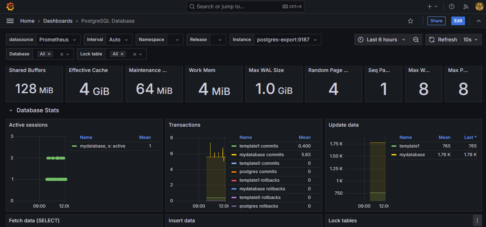
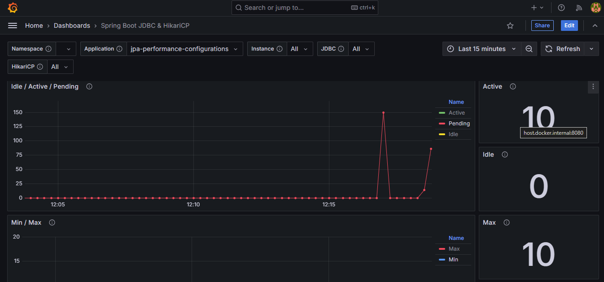

# HikariCP & JPA Performance Optimization

     

## Table of Contents

- [About](#about)
- [Getting Started](#getting-started)
  - [Prerequisites](#prerequisites)
  - [Installation](#installation)
- [Usage](#usage)
  - [API Endpoints](#api-endpoints)
  - [Monitoring Tools](#monitoring-tools)
- [Performance Optimizations](#performance-optimizations)
  - [Connection Pool Management](#connection-pool-management)
  - [JPA/Hibernate Optimizations](#jpa-hibernate-optimizations)
- [Best Practices for Future Implementation](#future-improvements)

## About <a name="about"></a>

This project demonstrates best practices for optimizing database connection usage in HikariCP and improving SQL query performance with Spring Data JPA and Hibernate. Performance metrics are visualized using Grafana via PostgreSQL exporter and Spring Boot Actuator with Prometheus, allowing you to monitor both the HikariCP connection pool and the PostgreSQL database.

## Getting Started <a name="getting-started"></a>

### Prerequisites <a name="prerequisites"></a>

- Docker Desktop
- Java JDK 21

### Installation <a name="installation"></a>

Start the application along with all required Docker services defined in `compose.yaml`:

```bash
./mvnw spring-boot:run
```

## Usage <a name="usage"></a>

### API Endpoints <a name="api-endpoints"></a>

The application is available at `http://localhost:8080/api` with the following endpoints:

- **GET** `/api/posts/{id}` - Retrieve a post by ID
- **PATCH** `/api/posts/{id}` - Update a post title
  ```
  Header: Content-type: application/json
  Body: { "title": "string" }
  ```

### Monitoring Tools <a name="monitoring-tools"></a>

- **Prometheus**: http://localhost:9090
- **Grafana**: http://localhost:3000
- **Postgres-exporter**: http://localhost:9187

The following Grafana dashboards are used to monitor the performance improvements:

- [PostgreSQL Database](https://grafana.com/grafana/dashboards/9628-postgresql-database/)
- [Spring Boot JDBC & HikariCP](https://grafana.com/grafana/dashboards/20729-spring-boot-jdbc-hikaricp/)

| PostgreSQL Database Dashboard | Spring Boot JDBC & HikariCP Dashboard |
|:----------------------------:|:------------------------------------:|
|  |  |

## Performance Optimizations <a name="performance-optimizations"></a>

### Connection Pool Management <a name="connection-pool-management"></a>

- **Disabled `spring.jpa.open-in-view`**: Prevents Hibernate from keeping database connections open for the entire duration of HTTP requests. This significantly reduces connection usage time in the connection pool.
  - **Before**: Connections were opened at the start of a request and remained open until the response was fully rendered.
  - **After**: Connections are only open during the actual database operation execution.
  - **Note**: With this option disabled, developers must explicitly handle lazy loading within transactional methods.

- **Disabled `spring.datasource.hikari.auto-commit`**: Ensures that database connections are only established when a database operation is actually called, not at the beginning of `@Transactional` methods.

```java
@Transactional(readOnly = true)
public PostResponseDto findById(Long id, Boolean withDelay) throws ResourceNotFoundException {
    // With auto-commit=true, a connection would be acquired here
    if (Boolean.TRUE.equals(withDelay)) {
        // CPU-intensive operation that doesn't need a DB connection
        for (int index = 0; index < 1000000; index++) {
            for (int index2 = 0; index2 < 1000; index2++) ;
        }
    }
    
    // With auto-commit=false, connection is acquired only at this point
    PostModel response = postRepository.findById(id)
            .orElseThrow(() -> new ResourceNotFoundException(String.format("Post with ID %d was not found!", id)));
    return mapper.map(response, PostResponseDto.class);
}
```

### JPA/Hibernate Optimizations <a name="jpa-hibernate-optimizations"></a>

- **`@DynamicUpdate` for partial updates**: For models with numerous columns where only a few fields are typically updated, this annotation simplifies the SQL queries generated by Hibernate.

- **Using `getReferenceById()` for relationships**: Avoids unnecessary SELECT queries when setting up entity relationships.

```java
@Transactional
public void importPosts() {
    if (Boolean.FALSE.equals(postRepository.existsPosts())) {
        List<PostModel> posts = mapper.map(jsonPlaceholderClient.fetchPosts(), PostModel.class);
        // Uses only the ID to create foreign key relationships without additional queries
        posts.forEach(post -> post.setUser(userService.getReferenceById(post.getUserId())));
        postRepository.saveAll(posts);
    }
}
```

- **`@Version` for optimistic locking**: Properly configures Hibernate to use PERSIST instead of MERGE for new entities, eliminating SELECT queries before INSERT operations. Combined with Spring Retry for handling concurrent modification conflicts:

```java
@Retryable(retryFor = OptimisticLockingFailureException.class, maxAttempts = 3, backoff = @Backoff(maxDelay = 1000))
@Transactional
public PostResponseDto patchPostTitleById(PostPatchDto patch, Long id) throws ResourceNotFoundException {
    if(RetrySynchronizationManager.getContext().getRetryCount() != 0) {
        logger.info(String.format("Retry Count: %s", RetrySynchronizationManager.getContext().getRetryCount()));
    }
    PostModel post = postRepository.findById(id)
            .orElseThrow(() -> new ResourceNotFoundException(String.format("Post with ID %d was not found!", id)));
    mapper.map(patch, post);
    return mapper.map(post, PostResponseDto.class);
}

@Recover
PostResponseDto recover(OptimisticLockingFailureException e){
    logger.info("The transaction could not be completed due to concurrent modifications. Please try again.");
    return null;
}
```

- **`@Transactional(readOnly = true)`**: Improves performance for read-only operations by skipping dirty checking and other Hibernate operations.

- **`FetchType.LAZY`**:  
  Setting relationships to `FetchType.LAZY` ensures that related entities are **not** fetched automatically, reducing unnecessary data retrieval. This helps **optimize performance** by avoiding the overhead of loading large aggregated data structures when they are not needed.

## Best Practices for Future Implementation <a name="future-improvements"></a>

- **Use Native Queries for Efficiency**:  
  Implement **native queries** to fetch only the necessary data from database entities and aggregates, **reducing overfetching** and improving performance.

- **Optimize Complex SQL Queries**:  
  Design **optimized SQL queries** to **mitigate the N+1 problem** and minimize the number of database connections, enhancing overall efficiency.

- **Careful Use of Transaction Propagation**:  
  The `propagation = REQUIRES_NEW` setting must be applied with caution, as it **creates a new transaction** and requires an **additional connection from the pool**, which may impact resource management.
